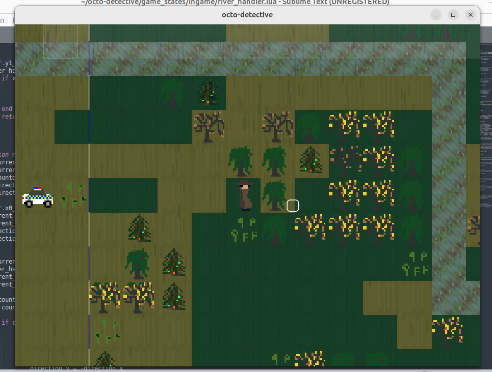

# Working name: octo-detective

## Summary
Type: A 2D Detective Game

You play as a detective, and try to solve crimes. 
Investigate the crime scene and see if you can solve the case. As you explore the level, you 
find clues that takes you closer to a resolution of the case. Arrest the correct person to 
close the case. 

## Game play
In menu: use the mouse start a new game or to exit the game. You can also exit the game with 
the escape key.  

In game: control the detective with arrow keys up,down,left,right and use space to discover 
clues (you will get a hint when a clue can be activated). 
Use the mouse to switch between clues in the summary, and in particular for selecting persons for arrestations, which are done at the police car.

Use escape to exit to the menu

## Techniques used
This project uses the Love 2D game engine, version 11.5
The programing language used is Lua

### Levels
In the folder levels, there is an example of a script that generates a map/level (map1.lua).
This script is written in lua and represents the whole level.
The idea is that the level file shall contain as much information as possible about the level, 
so that there is a great freedom for level designers to create (with relative ease) their own crime mysteries.
If you write your own level, be sure to name them map[number].lua and to put them in the correct folder. The numbers should be contigous.

In the level script map1.lua we see the following: 
* The level size
* The starting positions of the player and the police car
* Clues
  
The clues have among other properties:
* Postions where they can be activated
* A delay time in seconds, when they can be activated
* Depends on, an expression for which clues must have been discovered, in order for this clue to be discovered
* An image
* An alternative image, that when defined, is used to draw the clue on the ground.

## Progress and new features
There are some unimplemented features still, to make the game complete, and others 
that would be nice to have. This is a list of the features implemented and still 
not implemented:

* ~~Case closed, level complete, on the arrest of the correct person~~
* ~~Cold case, on the arrest of the incorrect person~~
* Animations
* Assistants, Liz, Gary and Rufus the german shepherd, to help solve the case
* ~~A page in the menu, for the controls~~
* ~~Save the results from a level, so the game remembers completed maps~~
* ~~Navigate the clue summary menu~~
* Dismiss clue information with a button press
* Clues that activate on a timer
* More complicated level designs, with lakes, roads, and urban areas
* Lakes 
* ~~Rivers~~
* ~~Different types of terrain~~
* ~~Start screen~~
* Day night cycle
* Better name generation
* A scrollable ledger
* Houses and buildings 
* ~~A name generator for optionally generating character names~~
* ~~Ability to choose between levels~~
* Many more levels
* ~~Weather~~
* Collisions with other persons on the map

## Third party assets
The music in this project (found in the third_party_assets folder) is not made or owned by me,
but comes from the website: https://www.nihilore.com/  
Made by the musician JAY OPIE

It is published under the Creative Commons Attribution 4.0 International license, see:
https://creativecommons.org/licenses/by/4.0/ 

It has not been modified.
 
